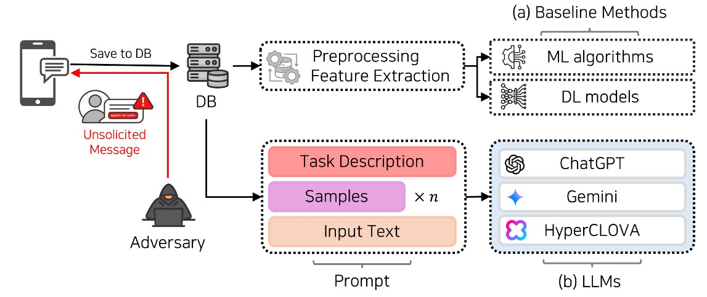

# Spam Detection
In this project, we aim to detect SMS spam messages using large language models (LLMs).



We evaluate spam messages in both English and Korean. We use the following prompt to evalute the effectiveness of the large language models.


# Get Started
1. Create an virtual environment with Python 3.13 and install the required packages in `requirements.txt`.
2. Place your dataset in the `./data` folder. Dataset in `.csv` format should be used.
3. Place your `API_KEY` in the `./models/{model_name}/{model_name}_api_0.py` file.
4. Paramter information can be adjusted in the same file.
   - `SHOT`, `METHOD`, `FILE_NAME`, `TIMEOUT_MIN`, `TIMEOUT_MAX`, `START_INDEX`, `END_INDEX` can be adjusted.
5. Evaluate your dataset using your API_KEY. For example, to evalute the performance of ChatGPT:
```
python ./models/chatGPT/chatGPT_api_0.py
```
**Note**:
- You can create multiple python files to execute different prompting methods.
    - ex) `chatGPT_api_1.py`, `chatGPT_api_2.py`, ...
- Multi-threading is not implemented.
- You can create multiple API_KEYs for faster results.
- You can download the most recent English spam dataset [here](https://github.com/smspamresearch/spstudy).

# Process the Results
1. Generated response are saved in the `./results` folder.
    - `./results/{model_name}/{prompt_method}/{few_shot}/{datset_name}_response.csv`.
2. Classify the generated response using `check_response.py` in the `./results/utils` folder:
```
python ./results/utils/check_response.py
```
3. Processed response will be saved in the same folder with the following name: `{dataset_name}_res_filtered.csv`.

4. Calculate the precision, recall, accuracy, and the f1-score using:
```
python ./results/utils/get_metrics.py
```

**Note**:
- We used the substring algorithm to disinguish the generated response.
- We recommend to create individual `check_response.py` file for each model and method as they all generate sentences in a different manner.
- `get_metrics_m3.py` is used to collect the generated score from a range of 1 to 10. 0 is used when no score is retrieved.
- Some manual operation may be needed in the response processing stage.

# Main Results
We find that GPT-4o achieves the best performance in the detection of spam messages in both the English and the Korean dataset.


Using Method_3, we adjust the threshold and find that value of 6 yields the best results.


